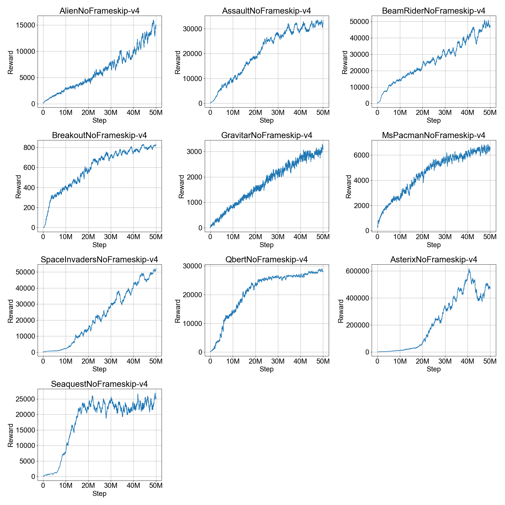

# Fast Sample Efficient Q-Learning With Recurrent IQN
## Background
I've recently been working on applying RL to modern games with visual inputs. These games typically require at least 2 dedicated CPU cores, and do not have emulation environments like the ALE which speed up the game, so each ENV runs very slowly in 'real time' at around 15 steps per second (60fps with a frame-skip of 4). Even if I could somehow get 256 distributed envs the acting throughput would still be too low to work well with distributed q-learning algorithms such as APEX and R2D2 without costing a huge amount of resources and time.

The current state of the art in discrete action spaces is [R2D2](https://openreview.net/forum?id=r1lyTjAqYX) which does very high-throughput distributed acting, using an LSTM model (with an LSTM layer between the CNN and FC layers of the classic DQN model). R2D2 essentially solves Atari games, reaching super-human on almost all of them. However it is not sample efficient, requiring billions of acting and training steps to reach these results, and falling short of other algorithms at the typical sample-efficient threshold of 200M (total) environment frames.

In the sample-efficient Atari domain we have:
- [Rainbow](https://arxiv.org/abs/1710.02298) which combines 6 separate DQN improvements each contributing to the final performance.
- [IQN](https://arxiv.org/abs/1806.06923) (Implicit Quantile Networks) is the state of the art 'pure' q-learning algorithm, i.e. without any of the incremental DQN improvements, with final performance still coming close to that of Rainbow.
- [Impala](https://arxiv.org/abs/1802.01561) (Deep Experts Variant) is a multi-actor distributed actor-critic algorithm with off-policy correction which achieves similar sample-efficient results at a very fast training rate, using a deeper and more complex model than the common Q-learning algorithms.

## Recurrent IQN
Here, I propose a 'toned down' sample-efficient version of R2D2, using the same LSTM model, but combining it with IQN and additional rainbow and R2D2 features, which can achieve up to a ~50% improvement on the Atari-57 benchmark.

Training is done on batch sizes of 32x20 (32 independent length-20 sequences), compared to the 64x80 used in R2D2. Acting is done on 32 vectorized ENVs, which along with the large batch size (20x larger than Rainbow/IQN which do 32x1 batches) can reach 200M (total) environment frames on Atari in less than a day on a single machine. This allows for quick experimentation and hyperparmameter tuning.

The number of ENVs can possibly be reduced as a trade-off between training time and availability of multiple ENVs.

Full code is available in the [RLtime Library](https://github.com/opherlieber/rltime).

## Resource Complexity Comparison
Following table compares the acting and training complexity of some existing algorithms with the method presented here:

||R2D2|DQN/Rainbow/IQN|Recurrent IQN|
|----|----|----|----|
|Total ENV Frames|~10B|200M|200M|
|Total Steps Trained|~10B|400M|200M|
|Total Batches Trained|2M|12.5M|312K|
|Training Batch Size|5120|32|640|
|Training Time (Atari)|5D|~7-10D|~18H1|

1 Using a single machine with a dedicated P100 or 1080ti GPU and 8+ CPUs

## Recurrent State With IQN
Using a recurrent model with IQN has some open questions, in particular how to handle the recurrent state across quantile samples. Some possible options considered:
1. Use a separate recurrent state for each sample. This requires a huge amount of memory in the replay buffer, since we are storing state for each transition in replay. Moreover it's not clear what is the correlation between recurrent state and the random quantiles drawn differently at each timestep (Alternatively maybe use the same quantile across the sequence or at least sort them between samples)
2. Repeat/Tile the recurrent state when entering the LSTM, and merge back (Using 'mean'). This solves the memory explosion, however there is no guarantee the recurrent state representation is 'mean friendly'. 2 options are supported for training sequences:
    * Repeat the recurrent state only at the start of the sequence, and merge back at the end.
    * Merge->Repeat the recurrent state at every timestep. This allows the merge/'mean' to participate in the backpropagation which may help the training learn a more 'mean-friendly' state representation. This results in slower training than the previous option.
3. An easier option is to insert the IQN layer after the LSTM layer and not deal with multi-sample recurrent state. This is simpler, and also results in much faster training time than running a multi-sample batch through the LSTM, but might lose some of the advanatage of IQN, in particular since the IQN layer size becomes ~6x smaller (Being applied to the 512 features from the LSTM output, compared to the ~3K features coming from the CNN layer as in the original paper)

RLtime supports both the 2nd and 3rd options above. The atari results presented here are using the simpler 3rd option (With 32 quantile samples). Some experimentation with the 2nd option did not show any improvement (Though this was done with only 8 quantile samples due to increased training complexity, which indirectly affects various hyperparameter choices so it's hard to compare)
## Results
To test the proposed method I use the 'Arcade Learning Environment' for learning to play classic Atari games, which allows for fast experimentation and comparison to existing papers. I use the atari envs provided by [OpenAI GYM](https://github.com/openai/gym).

### Test Setup and Hyperparameters
The following training/evaluation scheme is used for these results, to be as comparable as possible to the existing (sample-efficient) results we are comparing to:
- Environment episode frame limit of 108000 (30 minutes play time, reduced from the default 400K in GYM)
- Default (reduced) action-set, with up to 30 random no-op actions at start of episodes, and no sticky actions
- Episode termination on life-loss
- Frame-skip of 4 (with 2-frame 'max' merging).
- Hyperparameters are fixed for all games
- Evaluation is done on the final policy at 50M acting steps (200M total environment frames), using a fixed random-action epsilon of 0.001, taking the mean undiscounted reward across 100 episodes.

In addition:
- No frame-stacking is done, as this does not seem to give much when using an LSTM, and improves the replay buffer memory footprint which is not currently optimized for frame-stacking (This also acts as a sort of confirmation that the LSTM is indeed learning something in its state representation)
- Per-actor exploration as in the APEX/R2D2 papers, except the base value of 0.4 is decayed to 0.01 across half the training period, with an absolute minimum of 0.01 for all actors. This ensures more actors follow policy more often as training progresses, while still ensuring a minimal 0.01 rate for occasional exploration.
    - This limits the ability to train with fewer ENVs, in particular with 1 ENV, though in this case we can use the classic fixed epsilon decay from 1.0->0.01 which gives similar results on most games.
- Additional linear features are fed to the LSTM (Though it's not clear how much if at all these help):
    - One-hot encoded last action
    - Last reward (clipped)
    - Timestep (Scaled to [0,1] range)
- Enabled Q-Learning features:
    - Multi-Step (N=2) targets
    - Dueling Network Layers
    - Double Q-Learning
- Training frequency is set to '4', i.e. each acted transition is replayed 4 times (on average), compared to the '8' typically used in DQN variants, as 8 increases training time without any noticeable improvement to the results.

Additional features which gave mixed results and are not currently enabled:
- Prioritized replay buffer with same sequence priority weighting as the R2D2 paper, did not seem to make a big difference, though there are many hyper-parameters there which can be further explored.
    - Priority updates were tested using either the final IQN loss values, or the mean absolute sampled td-errors, with the latter performing better overall

- 'Value Function Rescaling' gives worse results in some games and a worse overall picture (Except for 'MsPacman', which reaches SOTA with 'value function rescaling' enabled)
- Recurrent state burn-in did not give conclusive differences

Full hyperparameters can be found in [this config file](https://github.com/opherlieber/rltime/blob/master/rltime/configs/atari_iqn_lstm.json) which can also be used to run these tests.

### Atari Results
Following are results for the Atari-57 benchmark (Minus 2 games, 'Defender' and 'Surround', which are missing in Gym or didn't work for some reason, so 55 games overall)

Recurrent IQN results are currently for a single run per game, and might change when averaging in additional seeds.

#### Median Normalized Scores
The median normalized score is a common metric for evaluating the overall performance of an RL algorithm. The normalized score for a game calculates how good the agents score is compared to a human player, relative to a random baseline score, and allows games with vastly different score ranges to be comparable. A normalized score of 100% means 'on par' with a human player. We then take the median normalized score across all games in the benchmark.

|Algo|Median Normalized Score|
|----|----|
|Impala Deep|192%|
|QR-DQN-1|211%|
|IQN|218%|
|Rainbow|230%|
|Recurrent IQN|365%|

 Imapala/QR-DQN/IQN numbers are taken from the respective papers. Rainbow score is taken from the IQN paper which is improved from the 223% reported in the original Rainbow paper.

#### Training Charts (Average reward of last 100 episodes)

#### Raw Evaluation Scores
Evaluation is done on the final policy with a fixed 0.001 exploration rate.

|Game|Rainbow|QR DQN|Impala Deep|IQN|Recurrent IQN|
|----|----|----|----|----|----|
|Alien|9492|4871|15962|7022|**16920**|
|Amidar|**5131**|1641|1555|2946|3944|
|Assault|14199|22012|19148|29091|**40874**|
|Asterix|428200|261025|300732|342016|**572150**|
|Asteroids|2713|4226|**108590**|2898|19432|
|Atlantis|826660|971850|849968|978200|**1004353**|
|Bank Heist|1358|1249|1223|1416|**1604**|
|Battle Zone|62010|39268|20885|42244|**650900**|
|Beam Rider|16850|34821|32463|42776|**60867**|
|Berzerk|2546|3117|1853|1053|**6158**|
|Bowling|30|77|60|**87**|30|
|Boxing|**100**|**100**|**100**|**100**|**100**|
|Breakout|418|742|787|734|**810**|
|Centipede|8167|**12447**|11050|11561|9850|
|Chopper Command|16654|14667|**28255**|16836|25720|
|Crazy Climber|168789|161196|136950|179082|**334946**|
|Defender|55105|47887|**185203**|53537|N/A|
|Demon Attack|111185|121551|132827|128580|**167621**|
|Double Dunk|0|22|0|6|**23**|
|Enduro|2126|2355|0|**2359**|**2359**|
|Fishing Derby|31|39|**45**|34|**45**|
|Freeway|**34**|**34**|0|**34**|**34**|
|Frostbite|9591|4384|318|4324|**25262**|
|Gopher|70355|113585|66782|118365|**124282**|
|Gravitar|1419|995|360|911|**3261**|
|H.E.R.O.|**55887**|21395|33731|28386|28650|
|Ice Hockey|1|-2|3|0|**43**|
|James Bond|N/A|4703|602|**35108**|21686|
|Kangaroo|14638|15356|1632|**15487**|14867|
|Krull|8742|**11447**|8147|10707|10726|
|Kung-Fu Master|52181|76642|43376|73512|**139177**|
|Montezumas Revenge|**384**|0|0|0|0|
|Ms. Pac-Man|5380|5821|**7342**|6349|7184|
|Name This Game|13136|21890|21537|**22682**|20598|
|Phoenix|108529|16585|210996|56599|**431765**|
|Pitfall!|**0**|**0**|-2|**0**|**0**|
|Pong|**21**|**21**|**21**|**21**|**21**|
|Private Eye|**4234**|350|99|200|100|
|Q*Bert|33818|**572510**|351200|25750|30463|
|River Raid|N/A|17571|**29608**|17765|9860|
|Road Runner|62041|64262|57121|57900|**537722**|
|Robotank|61|59|13|63|**101**|
|Seaquest|15899|8268|1753|**30140**|23938|
|Skiing|-12958|-9324|-10180|**-9289**|-10250|
|Solaris|3560|6740|2365|**8007**|2989|
|Space Invaders|18789|20972|43596|28888|**58154**|
|Star Gunner|127029|77495|200625|74677|**493299**|
|Surround|**10**|8|8|9|N/A|
|Tennis|0|**24**|1|**24**|-1|
|Time Pilot|12926|10345|48482|12236|**56723**|
|Tutankham|241|297|292|293|**301**|
|Up and Down|N/A|71260|332547|88148|**426973**|
|Venture|6|44|0|1318|**1723**|
|Video Pinball|533937|705662|572898|698045|**888107**|
|Wizard Of Wor|17863|25061|9158|**31190**|26402|
|Yars Revenge|102557|26447|84231|28379|**127085**|
|Zaxxon|22210|13112|32936|21772|**52074**|

Rainbow/QR-DQN/Impala/IQN results are taken from the respective papers.

[Spreadsheet with the scores](https://docs.google.com/spreadsheets/d/1J1INUtU8HmcaMtN48RYyQbLW6k2bBPykYjQvvpyniTg/edit?usp=sharing), including also random/human/DQN.

Raw data for these results, including final checkpoint, tensorboard data and training/evaluation logs can be found [here](https://console.cloud.google.com/storage/browser/rltime_results/9a2ef8e/atari/). These can be evaluated/rendered/recorded locally using the evaluation options described in the [RLtime readme](https://github.com/opherlieber/rltime/blob/master/readme.md).

These results are preliminary and may change when averaging in additional runs/seeds.

## References
[1] Will Dabney, et al. "[Implicit Quantile Networks for Distributional Reinforcement Learning](https://arxiv.org/abs/1806.06923)"

[2] Matteo Hessel, et al. "[Rainbow: Combining Improvements in Deep Reinforcement Learning](https://arxiv.org/abs/1710.02298)"

[3] Steven Kapturowski, et al. "[Recurrent Experience Replay in Distributed Reinforcement Learning](https://openreview.net/forum?id=r1lyTjAqYX)"

[4] Lasse Espeholt, et al. "[IMPALA: Scalable Distributed Deep-RL with Importance Weighted Actor-Learner Architectures](https://arxiv.org/abs/1802.01561)"

[5] Will Dabney, et al. "[Distributional Reinforcement Learning with Quantile Regression](https://arxiv.org/abs/1710.10044)"
